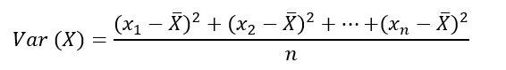
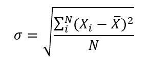

# Tema 1 - Principales Técnicas Estadísticas

## Introducción

### Distribuciones Teóricas de Probabilidad

* Distribución: reparto de elementos / individuos de un grupo / población según una característica

> Ejemplo: **Distribución de caramelos con azúcar y sin azúcar en una bolsa de caramelos.** Tenemos una bolsa de caramelos donde hay una mezcla de caramelos con azúcar y caramelos sin azúcar. Si existe el mismo número de caramelos con y sin azúcar, diríamos que es una distribución **uniforme**. La probabilidad de sacar un caramelo sin azúcar de la bolsa es 0,5.

#### Distribución de Frecuencias vs Distribución de Probabilidad

* **Distribución de Frecuencias:** Reparto empírico _(empírico = basado en la observación)_ observado en una **colección de datos.** Agrupación de datos en categorías mutuamente excluyentes _(caramelos con o sin azúcar)_ que indican el número de observaciones en cada categoría.

* **Distribución de Probabilidad:** Reparto teórico de la población, una función matemática. La distribución de probabilidad está definida sobre el **conjunto** de todos los sucesos, y cada uno de los sucesos es el **rango de valores** de la **variable aleatoria**. Describe cómo se espera que varíen los resultados.

* **Variable Aleatoria:** Función que asigna un valor, usualmente numérico, al resultado de un experimento aleatorio, lo que quiere decir que son los resultados que se presentan al azar en cualquier evento o experimento. Por ejemplo, los posibles resultados de sacar tres caramelos de la bolsa de caramelos.

**Ejemplo:**

  * **Conjunto de Datos:** Bolsa con N caramelos (donde N puede ser cualquier número de caramelos) donde hay dos tipos de caramelos: con y sin azúcar.
  * **Variable Aleatoria:** sacar tres caramelos de la bolsa de caramelos
  * **Posibles resultados:** [con, sin, sin], [sin, con, sin], [sin, sin , sin]...

### Tipos de Variables Aleatorias

* **Variable aleatoria discreta:** Es aquella que solo toma ciertos valores y que resulta principalmente del conteo realizado. Por ejemplo, que los caramelos sean con o sin azúcar.

* **Variable aleatoria continua:** Es aquella que resulta generalmente de la medición y puede tomar cualquier valor dentro de un intervalo dado. Por ejemplo, si nuestra bolsa de caramelos contiene caramelos redondos que pueden tener tamaños distintos, desde ser una bolita "pequeña" hasta una bolita "grande", pasando por todos los tamaños intermedios.

Conceptos básicos:

* **Varianza**:

* **Desviación Típica**: La desviación típica o estándar es una medida que ofrece información sobre la dispersión media de una variable. La desviación típica es siempre mayor o igual que cero.
    * Esperanza matemática, valor esperado o media: Es la media de nuestra serie de datos.
    * Desviación: La desviación es la separación que existe entre un valor cualquiera de la serie y la media.

* **Covarianza**: valor que indica el grado de variación conjunta de dos variables aleatorias respecto a sus medias.
    * Cuando los valores altos de una de las variables suelen mayoritariamente corresponderse con los valores altos de la otra, y lo mismo se verifica para los pequeños valores de una con los de la otra, se corrobora que tienden a mostrar comportamiento similar lo que se refleja en un valor positivo de la covarianza
    * Por el contrario, cuando a los mayores valores de una variable suelen corresponder en general los menores de la otra, expresando un comportamiento opuesto, la covarianza es negativa.
    * El signo de la covarianza, por lo tanto, expresa la tendencia en la relación lineal entre las variables.
    * `cov(X, Y) = E[(X - E[X])(Y - E[Y])]` _(Nota: `E[X]` = Valor esperado de X, o la media de X.)_

### El Teorema Central del Límite

Este método se utiliza con tamaños de muestra **grandes**. Es decir, en el ejemplo anterior, tener pocos pececillos enfermos no es suficiente para conocer cuál es el tratamiento adecuado para que se curen los pobrecillos. Si tenemos muchos peces, el resultado será más fiable, y esto lo conocemos gracias al **Teorema Central del Límite**.

- **Teorema Central del Límite**: Indica que, en condiciones muy generales, dada la suma de n variables aleatorias independientes y cuya dispersión se puede cuantificar, la función de distribución de `S(n)` _«se aproxima bien»_ a una **distribución normal** (también llamada distribución gaussiana, curva de Gauss o campana de Gauss).

- **Distribución Normal**: Esta distribución es muy utilizada en estadística ya que permite representar numerosos fenómenos, como por ejemplo, el de los pececillos mutates, pero también muchos otros de caracteres naturales, sociales, psicológicos, etc. La distribución normal se basa en la **justificación** de que una observación, o resultado final, se puede obtener como la **suma de causas pequeñas independientes**. La distribución normal es la más extendida en estadística y muchos tests estadísticos están basados en una "normalidad" más o menos justificada de la variable aleatoria bajo estudio.

<iframe width="560" height="315" src="https://www.youtube.com/embed/phY8Z9-TXCY" frameborder="0" allow="accelerometer; autoplay; encrypted-media; gyroscope; picture-in-picture" allowfullscreen></iframe>

### Pruebas de hipótesis

Este vídeo es útil para comprender en qué consiste una prueba de hipótesis:

<iframe width="560" height="315" src="https://www.youtube.com/embed/5ZvKgnRVSjI" frameborder="0" allow="accelerometer; autoplay; encrypted-media; gyroscope; picture-in-picture" allowfullscreen></iframe>

## Tipos de variables

- Dicotómica: puede ser un valor o su contrario, pero no los dos a la vez.
- Continua: puede tomar distintos valores entre un rango de valores
- Nominal:
- Ordinal:

## Bibliografía

- [Pruebas de Hipótesis para la diferencia de Medias](https://www.youtube.com/watch?v=yGelIc-H2ng)
- [Píldoras Matemáticas - La Distribución Normal](https://www.youtube.com/watch?v=phY8Z9-TXCY&list=PLwCiNw1sXMSBwU_UiiqvIctctvFICYkKC)
- [Píldoras Matemáticas - Probabilidad](https://www.youtube.com/watch?v=0mDGWgPdmng&list=PLwCiNw1sXMSC8S0jkSDJFLTtfMUh_O27s)
- [Píldoras Matemáticas - La Distribución Binomial](https://www.youtube.com/watch?v=Nl7BsFe4xmY&list=PLwCiNw1sXMSCHMq1BpUYbS_bkuUkK7a0O)
- [El test z para comparar dos proporciones (umh2072 2013-14)](https://www.youtube.com/watch?v=HMuS0VYMR6Y)
- [Distribución Normal - Wikipedia](https://es.wikipedia.org/wiki/Distribuci%C3%B3n_normal)
- [MaximaFormacion - Diferencias entre las proporciones de 2 poblaciones diferentes](https://www.maximaformacion.es/blog-dat/diferencias-entre-las-proporciones-de-2-poblaciones-diferentes/)
- [Prueba hipótesis z diferencia de dos proporciones](https://www.youtube.com/watch?v=vTYYEXG0jWo)
- [Apuntes](https://revistaseden.org/files/11-CAP%2011.pdf)
- [Prueba exacta de Fisher](https://www.youtube.com/watch?v=A6XJjFUNeYM)
- [Grados de Libertad - t de Student](https://www.redalyc.org/pdf/2031/203129458002.pdf)
- [Test de t de Student - Diferencia de Medias](https://www.youtube.com/watch?v=tR_8mY2OVY8)