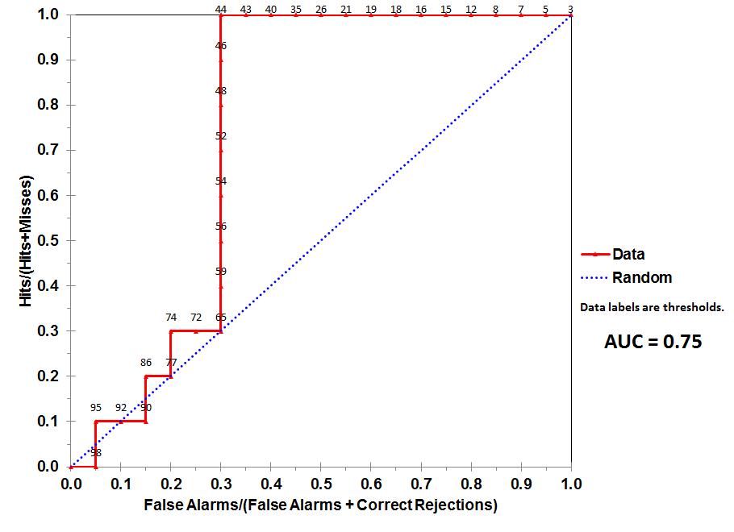

## Introducción

X es una variable _diagnóstico_ (explicativa)  continua e Y una variable _enfermedad_ (respuesta) dicotómica.
Un ejemplo de esta situación sería estudiar si el biomarcador dado por el PSA (X) sirve para diagnosticar el cáncer de próstata (Y).

Una forma de estudiar esta situación es **dicotomizar** la variable X, a través de una nueva X' para estar en un supuesto de *diagnóstico dicotómico* definido como:

Siendo `c` un **punto de corte** o **umbral** determinado de forma óptima:

```
X' = 0 para X >= c
X' = 1 para X < c
```

Donde:

* X' = 1 indica que la prueba diagnóstica afirma que el individuo **está enfermo**
* X' = 0 indica que la prueba diagnóstica afirma que el individuo **está sano**
* Y = 1 indica que la prueba diagnóstica afirma que el individuo **está realmente enfermo**
* Y = 0 indica que la prueba diagnóstica afirma que el individuo **está realmente sano**

Por lo que, para calcular la **sensibilidad**,  **especificidad**, **fracción de verdaderos positivos** y **fracción de falsos positivos** con respecto a `c`:

* sensibilidad(c) = `P(X' = 1|Y = 1) = P(X ≥ c|Y = 1)`
* fracción de verdaderos positivos(c) = `fvp(c)` = sensibilidad(c)
* especificidad(c) = `P(X' = 0|Y = 0) = P(X < c|Y = 0)`
* fracción de falsos positivos(c) = `ffp(c)` = especificidad(c)

## Curvas _roc_

A partir de las fracciones de verdaderos y falsos positivos se obtiene una curva. Se va obteniendo una curva a partir de **distintos puntos de corte**. Se define como:

_roc = “receiver operating characteristic”_

```
roc(·) = {(ffp(c), fvp(c)), c ∈ (−∞, +∞)}
```

Se representa `ffp(c)` en el eje de abcisas y `fvp(c)` en el eje de ordeandas.

### Área bajo la curva (auc)

El **área bajo la curva** (`auc`, _area under de curve_) es la integral de 0 a 1 de `roc(t)dt` y constituye un  índice de resumen de la bondad del biomarcador X. El auc se puede estimar por el método trapezoidal de suma de áreas de trapecios (ya que, en la gráfica, se forman trapecios):

Ejemplo de una gráfica de una curva roc:


**Se demuestra que son equivalentes el auc y el test U de Mann-Whitney**

Más info en: [General AUC calculated based on the trapezoidal rule](https://www.lexjansen.com/pharmasug-cn/2016/DS/PharmaSUG-China-2016-DS02.pdf)