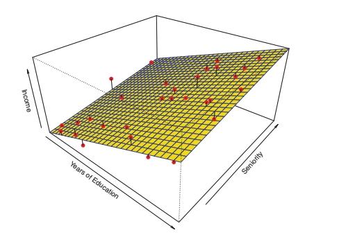
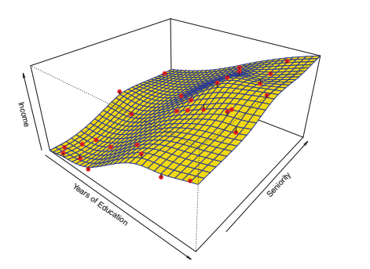
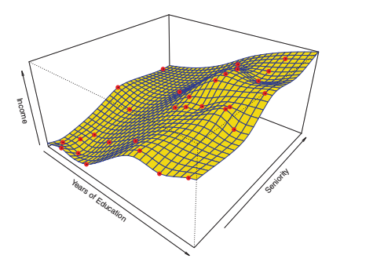

El objetivo es explorar métodos lineares y no lineares para estimar `f`. Estos métodos generalmente comparten varias características, por lo que es interesante conocer cuáles son esas características en común.

Se va a asumir que hemos observado un conjunto de `n` datos diferentes. Estas observaciones se llaman **datos de entrenamiento** porque se usan para entrenar o enseñar un método para estimar `f`.

Es decir, queremos encontrar una `f'` de manera que `Y ≈ f'(X)` para cualquier observación `(X, Y)`.

De manera genérica, podemos decir que la mayoría de los métodos de aprendizaje estadístico pueden clasificarse como paramétricos y no paramétricos.

# Métodos paramétricos

Los métodos paramétricos consisten en una enfoque de **dos pasos** basado en modelos.

**Paso 1: Suposición**

Primero, haremos una supusición sobre la forma de `f`. Por ejemplo, una simple suposición es que `f` es linear en `X`:

```
f(X) = β0 + β1X1 + β2X2 + ... + βpXp.
```

Esto es un **modelo linear** (se verá más adelante).

**Paso 2: Entrenamiento**

Después de seleccionar un modelo, necesitamos un procedimiento que use datos entrenados o que entrene el modelo. En el caso del modelo linear, necesitamos estimar los parámetros `β0, β1,...,βp.`. Es decir, necesitamos encontrar valores para dichos parámetros tal que:

```
Y ≈ β0 + β1X1 + β2X2 + ... + βpXp.
```

El enfoque basado en modelos se describe como **paramétrico**: disminuye el problema de estimar `f` a estimar un conjunto de parámetros. Asumiendo que la forma paramétrica de `f` simplifica el problema de estimar `f` ya que generalmente es mucho más **fácil** estimar un conjunto de parámetros que ajustar por completo una función `f`.

La desventaja potencial del enfoque paramétrico es que el model que escogemos se ajustará con la verdadera (y desconocida) forma de `f`. Si el modelo escogido está muy lejos de lo que es `f` en realidad, entonces nuestra estimación será **pobre**. Se puede intentar resolver este problema escogiendo **modelos flexibles** que puedan encajar muchas posibles formas de `f`. Pero en general, conseguir ajustar un modelo más flexible requiere estimar un mayor número de parámetros. Esos modelos son más complejos y pueden llevar a un fenómeno conocido como **overfitting** (_sobreajuste_) de los datos.

**Ejemplo:**

Queremos calcular los **ingresos** (_income_) de una persona en base a una función que utiliza como variables de entrada los **años de educación** (_education_) y el nivel de **experienca** (_seniority_). Tenemos datos de 30 personas.

Aplicando un **modelo linear**, podríamos considerar esto:

```
income ≈ β0 + β1 × education + β2 × seniority.
```

De manera que nos tendríamos que limitar a conocer los valores de `β0, β1 y β2`, para lo que se podría utilizar, por ejemplo, **regresión linear cuadrática** (_squares linear regression_)

# Métodos no-paramétricos

Los métodos no-paramétricos no hacen suposiciones explícitas sobre la forma funcional de `f`. En lugar de eso, buscan una estimación de `f` que se aproxime a los puntos de datos tanto como sea posible sin que el resultado sea demasiado _ondulado_ o _rugoso_. 

Estas estimaciones pueden tener una mayor ventaja sobre aproximaciones paramétricas: evitando la suposición de una forma funcional particular de `f`, consiguen el potencial de, de manera precisa, ajustarse a un rango más grande de posibles formas de `f`. Cualquier aproximación paramétrica trae con eso la posibilidad de que la forma funcional utilizada para estimar `f` sea **muy diferente** de la verdadera `f`, en cuyo caso, el modelo resultado no encajará con los datos tan bien.

Por el contrario, las aproximaciones no paramétricas evitan por completo este riesgo, ya que básicamente no asumen nada sobre la forma de `f`. Pero las aproximaciones no paramétricas sí que tienen una desventaja: ya que no reducen el problema de estimar `f` a un pequeño número de parámetros, es necesario hacer muchísimas observaciones (muchas más que las que se necesitan si se sigue una aproximación paramétrica) para obtener una estimación precisa de `f`.

**Ejemplo: Comparativa**

Estos gráficos representan los ingresos de una persona como una función de los años de educación y la experiencia dado un conjunto de datos de 30 personas. La superficie, en cada uno de ellos, representa la relación entre estas variables. En estos gráficos podemos ver las diferentes formas que toma la superficie, dependiendo del método que se utilice para calcular `f`.

* Gráfica de Ingresos - Linear



* Gráfica de Ingresos - Método Paramétrico - Smooth Spline



* Gráfica de Ingresos - Método No-Paramétrico - Rought Spline.



# El equilibro entre "precisión de la predicción" e "interpretación del modelo"

Algunos modelos son menos flexibles, o más restrictivos, en el sentido de que pueden producir un rango relativamente pequeño de formas para estimar `f`. Por ejemplo, la regresión linear es una estimación relativamente flexible, pero sólo puede generar funciones lineales.

Entonces, **¿por qué querríamos escoger una aproximación más restrictiva en lugar de una más flexible?**. Hay varias razones por las cuáles podríamos preferir un modelo más restrictivo.

Por ejemplo, si estamos interesados en cómo **infieren** los datos, el modelo linear puede ser una buena elección ya que es fácil entender la relación entre `Y` y `X1, X2, ... XP`. Por el contrario, esa flexibilidad puede conllevar a estimaciones complicadas difíciles de `f` que hace complicado entender la asociación de cualquier indicador con la respuesta.

En otros casos, sin embargo, sólo estaremos interesados en hacer una **predicción**. Si queremos por ejemplo desarrollar un algorithmo que sea capaz de predecir el precio de una acción, querremos un modelo flexible.

¡Pero cuidado! Se puede dar el caso de obtner predicciones más precisas usando el método menos flexible. Este fenómeno, que a priori puede parecer contraintuitivo, tiene mucho que ver con el **overfitting** de los métodos muy flexibles.