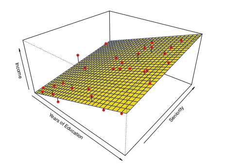

## Introducción al Aprendizaje Supervisado

* [An Introduction to Statistical Learning](http://faculty.marshall.usc.edu/gareth-james/ISL/), _Gareth James • Daniela Witten • Trevor Hastie Robert Tibshirani_

El aprendizaje estadístico supervisado consiste, en general, en construir un modelo estadístico para predecir o estimar unos **datos de salida** (output) basados en uno o más **datos de entrada** (input).

Por ejemplo, en campos como los negocios, la medicina o la astrofísica. El aprendizaje estadístico no supervisado, sí que existen datos de entrada pero no se tienen en cuenta los datos de salida. Sin embargo, se pueden establecer relaciones de esos datos.

### Ejemplo de caso de uso

Imaginemos que trabajamos en un departamento de ventas y queremos conocer la relación entre publicidad y ventas, para saber ajustar presupuestos publicitarios (el dinero destinado a publicidad) e incrementar las ventas. Nuestro objetivo sería desarrollar un modelo preciso que pueda precedir las ventas dados tres tipos de medios: televisión, radio y periódico.

Los **datos de entrada** son conocidos por: variables de entrada (_input variables_), variables independientes, (_independent variables_) características (_features_) o simplemente variables (_variables_)

Los **datos de salida** son conocidos por: variable de salida (_output variable_), respuesta (_response_), o variable dependiente (_dependent variable_)

* input
  * X1: presupuesto para televisión
  * X2: presupuesto para radio
  * X3: presupuesto para periódico
* output
  * Y: ventas

Generalmente hablando, si observamos una respuesta `Y` y un número _p_ de de variables independientes (`X1, X2... Xp`), asumimos que hay una relación entre `Y` y `X = (X1, X2,...,Xp)`:

```
Y = f(X) + e
```

* `e` sería el _error_, que es **independiente de `X`** y cuya media es 0
* `f` representa la información _sistemática_ que `X` nos da sobre `Y`

En esencia, el aprendizaje estadístico se refiere en las aproximaciones para estimar `f`. Por esto, veremos:

* Conceptos teóricos a la hora de estimar `f`
* Herramientas para evaluar las estiamciones obtenidas

### ¿Por qué estimar `f`?

#### Predicción

La estimación permite predecir un valor `Y` en aquellas situaciones donde tenemos información disponible sobre `X`, pero no es tan sencillo obtener `Y`.

**Ejemplo:**

Supongamos que `X1, ...Xp` son características de una muestra de sangre de un paciente que se pueden medir fácilmente en un laboratorio. `Y` es la variable que codifica el riesgo del paciente de tener una reacción adversa a un medicamento. Lo natural es buscar cómo precedir `Y` utilizando `X`, ya que podemos **no dar el medicamento** en cuestión a los pacientes que tienen un alto riesgo de tener una reacción adversa, es decir, pacientes para los que **la estimación de `Y` es alta**.

---

* `f'`: representa la estimación de `f`
* `Y'`: representa la predicción **resultante** de `Y`

```
Y' = f'(X)
```

Normalmente `f'`, actúa como una **caja negra** (es decir, no sabemos lo que _hace dentro_, sino que solo sabemos el input y el output) Decimos que hay un error porque, realmente, `f'` no va actuar exactamente como `f`. Encontraremos dos tipos de errores:

* Error reducible: Podemos conseguir que `Y'` se parezca más a `Y` modificando `f'`, obteniendo así un mejor resultado tras cada modificación.
* Error irreducible: Por mucho que modifiquemos, optimicemos y mejoremos `f'`, siempre habrá, por definición, algo de error, ya que por definición, decimos que es **imposible** predecir `Y`.

> No matter how well we estimate `f`, we cannot reduce the error introduced by `e`

Sobre el error irreducible, sabemos que:

* Tiende a `0`, es decir, siempre es mayor que `0`
* `e` puede contener variables que no pueden ser medidas, pero que pueden ser útiles para predecir `Y`. Pero como no podemos medirlas, `f` no puede usarlas en la predicción.
* `e` puede contener variaciones que no tampoco pueden ser medidas, como por ejemplo, el riesgo de que un medicamento provoque una reacción en un paciente, pudiendo variar esta reacción de un día a otro en relación al estado anímico de éste.

```
expected_value = E(Y - Y')^2 = E(f(X) + e - f'(x))^2 = E(f(X) - f'(x))^2 + Var(e)
```

donde:

```
error_reducible = E(f(X) - f'(x))^2
error_irreducible =  Var(e) = varianza asociada con e
```

**Ejemplo:**

Consideremos que una compañía esta interesada en conducir una campaña de marketing. El objetivo es identificar a personas que vayan a responder de manera positiva a un correo, basándonos en observaciones de variables demográficas medidas en cada una de esas personas. En este caso, las **variables demográficas** se pueden utilizar como **indicadores**, y la respuesta a la campaña de márketing (positiva o negativa) se utiliza como dato de **salida**. La compañía no está interesada en tener un conocimiento profundo de la relación entre los indicadores de cada persona y la respuesta, sino que simplemente quiere un modelo preciso para predecir la respuesta utilizando los indicadores.

#### Inferencia

Nos interesa saber de qué manera le afecta a `Y` los distintos valores que puede tomar `X`. En esta situación, aunque queremos estimar `f`, el verdadero objetivo no es hacer predicciones de `Y`. En lugar de eso, queremos entender la **relación** entre `X` e `Y` o, para ser más específicos, entender cómo cambia `Y` en función de `X1, ....XP`. En este caso, **no podemos tratar** a `f'` como una **caja negra**, ya que **necesitamos saber qué hace**.

* **¿Qué indicadores (_predictors_) están relacionados con la respuesta?**

Es muy común el caso en el que sólo una pequeña porción de los indicadores disponbiles están relacionados con `Y` considerablemente.
Identificar qué indicadores son los **importantes** entre un gran número de variables posibles puede ser increíblemente **útil** dependiendo de la aplicación.

* **¿Cuál es la relación entre la respuesta y cada indicador?**

Algunos indicadores pueden tener una relación positiva con `Y`, en el sentido de que incrementar el indicador está asociado con incrementar los valores de `Y`.

Otros indicadores pueden tener una relación contraria.

Dependiendo de la complejidad de `f`, la relación entre la respuesta y un indicador puede también depender de los valores de otros indicadores.

* **¿Puede la relación entre `Y` y cada indicador abreviarse correctamente utilizando una ecuación linear, o es más complicado?

La mayoría de métodos para estimar `f` toman una forma lineal. En algunas situaciones, este supuesto o hipótesis es razonable o incluso deseable, pero es muy posible que la relación sea mas complicado, en cuyo caso, el modelo linear puede no darnos una representación precisa de esta relación entre input y output.

**Ejemplo:**

Queremos modelar la marca de un producto que un consumidor puede comprar basándonos en variables como el **precio**, la **ubicación de la tienda**, los **niveles de descuento** o el **precio de la competencia**. En esta situación estaríamos más interesados en cómo cada una de las variables individuales afectan a la probabilidad de que se produzca una compra. Por ejemplo, ¿qué efecto tiene el cambio del precio de un producto con respecto a las ventas?

---

En algunos casos, es posible que un modelo se utilice tanto para predicción como para inferencia de datos. Dependiendo de si el objetivo final es predicción, inferencia o una combinación de ambos, se utilizarán diferentes métodos para estimar `f`. Por ejemplo, modelos lineales son relativamente simples para calcular inferencia, pero pueden no ser tan precisos para hacer predicciones como otras aproximaciones.

### ¿Cómo estimar `f`?

El objetivo es explorar métodos lineares y no lineares para estimar `f`. Estos métodos generalmente comparten varias características, por lo que es interesante conocer cuáles son esas características en común.

Se va a asumir que hemos observado un conjunto de `n` puntos de datos diferentes. Estas observaciones se llaman **datos de entrenamiento** porque se usan para entrenar o enseñar un método para estimar `f`.

Es decir, queremos encontrar una `f'` de manera que `Y ≈ f'(X)` para cualquier observación `(X, Y)`.

De manera genérica, podemos decir que la mayoría de los métodos de aprendizaje estadístico pueden clasificarse como paramétricos y no paramétricos.

#### Métodos paramétricos

Los métodos paramétricos consisten en una enfoque de **dos pasos** basado en modelos.

**Paso 1: Suposición**

Primero, haremos una supusición sobre la forma de `f`. Por ejemplo, una simple suposición es que `f` es linear en `X`:

```
f(X) = β0 + β1X1 + β2X2 + ... + βpXp.
```

Esto es un **modelo linear** (se verá más adelante).

**Paso 2: Entrenamiento**

Después de seleccionar un modelo, necesitamos un procedimiento que use datos entrenados o que entrene el modelo. En el caso del modelo linear, necesitamos estimar los parámetros `β0, β1,...,βp.`. Es decir, necesitamos encontrar valores para dichos parámetros tal que:

```
Y ≈ β0 + β1X1 + β2X2 + ... + βpXp.
```

El enfoque basado en modelos se describe como **paramétrico**: disminuye el problema de estimar `f` a estimar un conjunto de parámetros. Asumiendo que la forma paramétrica de `f` simplifica el problema de estimar `f` ya que generalmente es mucho más **fácil** estimar un conjunto de parámetros que ajustar por completo una función `f`.

La desventaja potencial del enfoque paramétrico es que el model que escogemos se ajustará con la verdadera (y desconocida) forma de `f`. Si el modelo escogido está muy lejos de lo que es `f` en realidad, entonces nuestra estimación será **pobre**. Se puede intentar resolver este problema escogiendo **modelos flexibles** que puedan encajar muchas posibles formas de `f`. Pero en general, conseguir ajustar un modelo más flexible requiere estimar un mayor número de parámetros. Esos modelos son más complejos y pueden llevar a un fenómeno conocido como **overfitting** (_sobreajuste_) de los datos.

**Ejemplo:**

Queremos calcular los **ingresos** (_income_) de una persona en base a una función que utiliza como variables de entrada los **años de educación** (_education_) y el nivel de **experienca** (_seniority_). Tenemos datos de 30 personas.

Aplicando un **modelo linear**, podríamos considerar esto:

```
income ≈ β0 + β1 × education + β2 × seniority.
```

De manera que nos tendríamos que limitar a conocer los valores de `β0, β1 y β2`, para lo que se podría utilizar, por ejemplo, **regresión linear cuadrática** (_squares linear regression_)

#### Métodos no-paramétricos

Los métodos no-paramétricos no hacen suposiciones explícitas sobre la forma funcional de `f`. En lugar de eso, buscan una estimación de `f` que se aproxime a los puntos de datos tanto como sea posible sin que el resultado sea demasiado _ondulado_ o _rugoso_. 

Estas estimaciones pueden tener una mayor ventaja sobre aproximaciones paramétricas: evitando la suposición de una forma funcional particular de `f`, consiguen el potencial de, de manera precisa, ajustarse a un rango más grande de posibles formas de `f`. Cualquier aproximación paramétrica trae con eso la posibilidad de que la forma funcional utilizada para estimar `f` sea **muy diferente** de la verdadera `f`, en cuyo caso, el modelo resultado no encajará con los datos tan bien.

Por el contrario, las aproximaciones no paramétricas evitan por completo este riesgo, ya que básicamente no asumen nada sobre la forma de `f`. Pero las aproximaciones no paramétricas sí que tienen una desventaja: ya que no reducen el problema de estimar `f` a un pequeño número de parámetros, es necesario hacer muchísimas observaciones (muchas más que las que se necesitan si se sigue una aproximación paramétrica) para obtener una estimación precisa de `f`.

**Ejemplo: Comparativa**

Estos gráficos representan los ingresos de una persona como una función de los años de educación y la experiencia dado un conjunto de datos de 30 personas. La superficie, en cada uno de ellos, representa la relación entre estas variables. En estos gráficos podemos ver las diferentes formas que toma la superficie, dependiendo del método que se utilice para calcular `f`.

* Gráfica de Ingresos - Linear



* Gráfica de Ingresos - Método Paramétrico - Smooth Spline


* Gráfica de Ingresos - Método No-Paramétrico - Rought Spline.


### El equilibro entre "precisión de la predicción" e "interpretación del modelo"

Algunos modelos son menos flexibles, o más restrictivos, en el sentido de que pueden producir un rango relativamente pequeño de formas para estimar `f`. Por ejemplo, la regresión linear es una estimación relativamente flexible, pero sólo puede generar funciones lineales.

Entonces, **¿por qué querríamos escoger una aproximación más restrictiva en lugar de una más flexible?**. Hay varias razones por las cuáles podríamos preferir un modelo más restrictivo.

Por ejemplo, si estamos interesados en cómo **infieren** los datos, el modelo linear puede ser una buena elección ya que es fácil entender la relación entre `Y` y `X1, X2, ... XP`. Por el contrario, esa flexibilidad puede conllevar a estimaciones complicadas difíciles de `f` que hace complicado entender la asociación de cualquier indicador con la respuesta.

En otros casos, sin embargo, sólo estaremos interesados en hacer una **predicción**. Si queremos por ejemplo desarrollar un algorithmo que sea capaz de predecir el precio de una acción, querremos un modelo flexible.

¡Pero cuidado! Se puede dar el caso de obtner predicciones más precisas usando el método menos flexible. Este fenómeno, que a priori puede parecer contraintuitivo, tiene mucho que ver con el **overfitting** de los métodos muy flexibles.

### Aprendizaje supervisado vs no supervisado

### Problemas de Regresión vs Problemas de Clasificación
## Evaluación de la precisión de modelos
### Midiendo la Calidad del ajuste ("Quality of Fit")
### El equilibrio entre sesgo (bias) y varianza
### Ajuste de la classificación