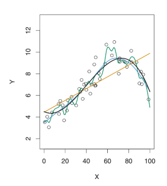
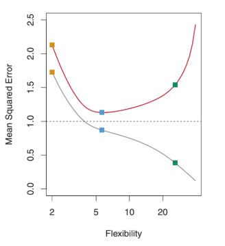
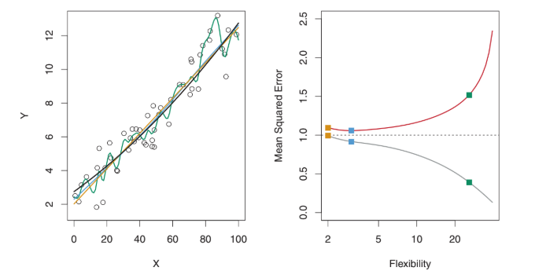
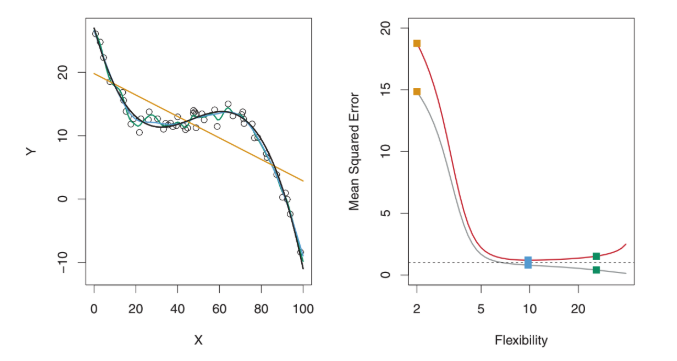

# Quality over Fit

No existe un método perfecto, sino que el reto consiste en encontrar la mejor aproximación para encontrar una solución al problema que nos planteamos.

Para evaluar la eficiencia de un método de aprendizaje estadistico dado un conjunto de datos, necesitamos alguna manera de medir cómo de bien las predicciones de dicho modelo encajan con los datos observados. Es decir, necesitamos **cuantificar** cómo de cerca está cada respuesta de una observación con el verdadero valor de esa observación.

Lo más utilizado es el **mean squared error** (MSE):

```
MSE = 1 / n * [(yi − f'(xi))^2, ..., (yn − f'(xn))^2]
```

Dónde:

* `f'` es la **predicción**
* `n` es el **número de observaciones**
* cada `xi` es una observación
* cada `yi` es la respuesta a una observación

El MSE será pequeño si las respuestas de la predicción son muy parecidas a las verdaderas, y será grande si estas difieren de manera substancial.

Lo que nos interesa es: **la precisión de las predicciones que obtener cuando aplicamos el método a datos de prueba que no conocemos previamente**. Estos es porque, si por ejemplo, tenemos los datos clínicos de un número de pacientes y ya sabemos si esos pacientes tienen o no diabetes, lo que nos interesa es que el método prediga de manera precisa si futuros pacientes (datos que no conocemos) van a padecer o no diabetes en base a esas variables (es decir, no nos interesa saber si el método es bueno para pacientes que ya sabemos si tienen o no diabetes)

Lo que queremos saber es si `f'(x0)` es aproximadamente igual a `y0` donde `(x0, y0)` es una observación que **no se ha utilizado** para entrenar el método. Queremos elegir el método que nos dé el menor **test MSE** (error en los datos de prueba), opuesto al menor **training MSE** (error en los datos de entrenamiento). Para ello, lo que podemos hacer para elegir entre un método u otro es elegir aquél que tenga la media del **test MSE** más pequeña.

```
Ave(y0 − f('x0))^2
```

Pero, ¿Cómo podemos seleccionar el método que minimize el **test MSE**? Dependerá de si conocemos o no las observaciones, o los datos de entrenamiento, disponibles.

* Si conocemos las observaciones: Evaluar las pruebas y seleccionar el método en el cual el **test MSE** es menor.
* Si no conocemos las observaciones: Seleccionar un método que que minimice el **training MSE**. Pero esto puede ser frágil, ya que es posible que el **test MSE** y el **training MSE** estén muy relacionados, y, por esto, no está garantizado que el método con el menor **training MSE** tenga también el menor **test MSE**. Esto podemos ver que sucede en este ejemplo:

* **Estimaciones de `f` con diferentes métodos:** 
    * Línea negra: datos simulados de `f`
    * Línea naranja: regresión lineal
    * Líneas azul y verde: smoothing spline fit



* **Flexibilidad vs MSE:**
    * Línea gris: Training MSE
    * Línea roja: Test MSE
    * Línea horizontal de puntos: mínimo test MSE de todos los métodos
    * Cuadrados: Representan los training MSE y test MSE respectivamente de los tres métodos (naranja, azul y verde) de la gráfica anterior



Aquí, como `f` no es lineal, la línea naranja de la primera gráfica no es lo suficientemente flexible para estimar bien `f`. La línea verde tiene el menor **training MSE** de los tres métodos, como vemos que corresponde a la curva más flexible de la primera gráfica.

Otro ejemplo con unos datos que se aproximan más a una función lineal:



Que podemos ver cómo de diferente es para datos que no encajan con una función lineal:



# **Overfitting**

En la segunda gráfica podemos ver cómo, de manera que la flexibilidad del método estatístico aumenta, hay un decrecimiento monótono del **training MSE** y una la **test MSE** tiene forma de U. Esta es una **propiedad fundamental** del aprendizaje estadísitco: independientemente de un conjunto de datos praticulares e independientemente del método estadístico utilizado, de manera que la flexibilidad aumenta, el **training MSE** disminuye, pero puede que el **test MSE** no. Cuando Un método produce un pequeño **training MSE** pero un gran **test MSE**, estaremos hablando de **overfitting**.

Esto sucede porque el procedimiento utilizado está trabajando demasiado duro en encontrar un patrón en los datos de entrenamiento, y puede estar usando algunos patrones que pasan **por casualidad** o **azar**, en lugar de ser verdaderas propiedades de `f`. Cuando hay **overfit**, el **test MSE** suele ser muy grande porque los supuestos patrones que suceden por casualidad no van a estar en los datos de prueba. Independientemente de que ocurra o no overfitting, casi siempre hemos de esperar que el **training MSE** sea menor que el **test MSE** porque la mayoría de los métodos estadísticos, de manera directa o indirecta, buscan minimizar el **training MSE**.