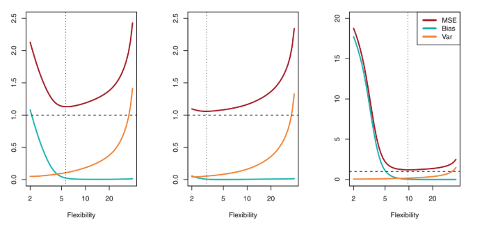

Cuando se produce una curva de **test MSE** con forma de U, suele ser el resultado de dos propiedades que compiten en el método de aprendizaje estadístico. No nos vamos a centrar en la comprobación matemática, pero es posible saber que el esperado **test MSE** para un valor dado `x0` puede ser descompuesto en la **suma de tres cantidades fundamentales**:

* La varianza de `f'(x0)`: Se refiere a la cantidad de `f'` que puede variar si se estima usando un conjunto de datos diferente. Diferentes conjuntos de datos producen diferentes `f'`, pero lo ideal sería que `f'` no variara demasiado (que sea menos flexible). **Los métodos estadísticos más flexibles tienen mayor varianza**.

* El sesgo al cuadrado de `f'(x0)`: Se refiere al error introducido al aproximar un **problema de la vida real**. Por ejemplo, si usamos una relación lineal entre `Y` y `X1, X2, ..., XP`, ya que es muy raro que en la vida real haya una relación lineal tan sencilla, estaremos introduciendo un bias o sesgo al estimar `f`. **Los métodos estadísticos más flexibles tienen menor bias**

* La varianza del error `e`

Con esto, tenemos que la **covarianza** de `y0` y `f'(x0)` es igual a  la **varianza** de `f'(x0)` más el sesgo al cuadrado de `f'(x0)` más la varianza del error `e`:

* La media del **test MSE** = covarianza de `y0` y `f'(x0)`:

```
Cov(y0, f'x(0)) = E[(y0 - f'x(0))^2]
```

```
E[(y0 - f'x(0))^2] = var(f'(x0)) + [Bias(f'(x0))]^2 + var(e)
```

Con esta ecuación, vemos que para miniminzar el **test MSE**, necesitamos elegir un método que de manera simultánea consiga una **menor varianza** y un **menor sesgo**.

Como la **varianza** es siempre mayor o igual que 0, y el cuadrado del sesgo (bias) también, el **test MSE** nunca va a estar por debajo de `var(e)`, que es el **error irreducible**.



La relación entre sesgo y varianza nos dice que un buen método estadístico producirá un resultado con una varianza baja pero también un sesgo al cuadrado bajo. Esto es un reto, ya que es muy **fácil** obtener un método con un sesgo muy bajo pero una varianza muy alta, o un método con una varianza muy baja pero un bias muy alto.